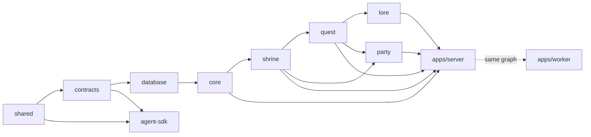
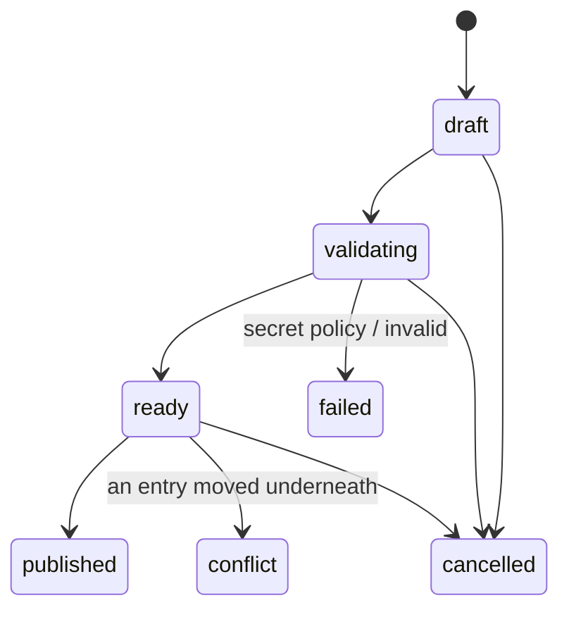
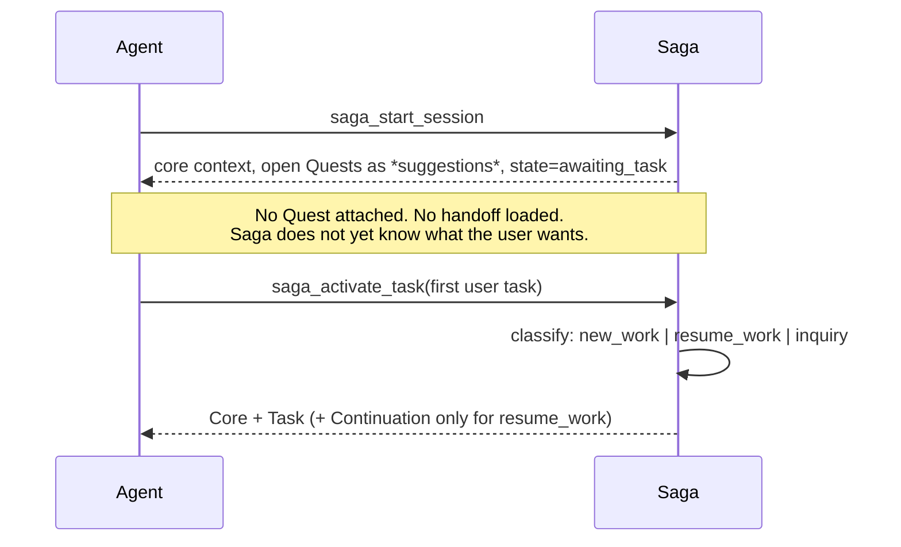

# Saga — Architecture

> _No agent starts at level one._

Saga is a shared project-memory, work-continuity and coordination system for coding agents.
This document covers the domains, who owns which piece of state, and the invariants that hold
the design together.

---

## 1. Terminology

| Concept                      | Product name | Database name              |
| ---------------------------- | ------------ | -------------------------- |
| The system                   | Saga         | —                          |
| Persistent project knowledge | Lore         | `lore.*`                   |
| One unit of knowledge        | Lore Entry   | `lore.memory_items`        |
| A work item                  | Quest        | `quest.work_items`         |
| A parent work item           | Questline    | parent/child work item     |
| An agent's period of work    | Session      | `quest.sessions`           |
| A progress record            | Checkpoint   | `quest.checkpoints`        |
| A final continuation record  | Handoff      | checkpoint `final_handoff` |
| Active agents                | Party        | `party.*`                  |
| A live agent process         | Agent Run    | `party.agent_runs`         |
| A resource reservation       | Claim        | `party.claims`             |
| The operations area          | Shrine       | `shrine.*`                 |
| The web console              | Guild Hall   | `apps/web`                 |

Source code and database objects use plain technical names. Product modules and UI labels use
Lore, Quest, Party and Shrine.

---

## 2. Domains and dependency direction



The direction is enforced by TypeScript project references generated from one spec
(`scripts/scaffold-packages.mjs`), so a cycle is a build error rather than a review comment.

Each domain package is layered:

```text
domain/         types and invariants — pure, no I/O
repositories/   raw SQL behind an interface, taking an explicit Queryable
services/       transaction boundaries and state transitions
```

Route handlers live in `apps/server/src/routes` and contain **no business SQL**: they validate
input with a Zod contract, call a service, and let the error handler translate domain errors.

### Cross-domain communication

A domain is meant to reach another domain's state through its own repositories, not by
querying another schema directly. Where a lower package needs data from a higher one, the
higher package registers a contributor at composition time:

| Registry                   | Who registers      | What it provides                                         |
| -------------------------- | ------------------ | -------------------------------------------------------- |
| `HealthRegistry`           | every domain       | health checks for `/health/ready` and Shrine             |
| `MetricsContributors`      | Lore, Quest, Party | per-domain counters for the metrics summary              |
| `ProjectStatsContributors` | Lore, Quest, Party | per-project counters for the Projects page               |
| `PartyHooks`               | the application    | lets Quest start/stop agent runs without importing Party |
| `ContinuationProvider`     | Quest              | lets Lore's context builder include a handoff            |
| `PartyContextProvider`     | Party              | the coordination layer of agent context                  |
| `OutboxDispatcherRegistry` | any domain         | reacts to a durable event                                |
| `JobHandlerRegistry`       | any domain         | a background job type                                    |

`apps/server/src/composition.ts` is the single place this wiring happens; reading it top to
bottom shows the whole system's shape.

TypeScript project references, generated from one spec (`scripts/scaffold-packages.mjs`), make
an *import* across the boundary a build error. That guarantee stops at the language boundary,
though: references cannot see inside a SQL string, so a repository is free to name another
domain's schema in a query and the build will not notice it. Three call sites do this today,
each a deliberate exception rather than an oversight:

| Site | Crosses | Why it stands |
| ---- | ------- | -------------- |
| `packages/core/src/repositories/outbox-repository.ts:142-156` (`listUnprojected`) | Core reads `shrine.system_events` — the lower-reads-higher case the contributor mechanism exists for | The anti-join backs a rare, bounded repair job over a retention-capped table. Postgres hash-joins the anti-join regardless of an expression index on the JSON path, so routing it through a contributor would add ceremony without changing the query plan (`HANDOFF.md`). |
| `packages/party/src/repositories/party-repository.ts:121` and `:653` | Party reads `quest.work_items` to embed a Quest's title in a Party read result | Party already depends on `@saga/quest` at the package level, so the join doesn't cross the *build* boundary — only the "never reads another domain's tables" sentence. It is a same-request denormalized read, not business logic that belongs in Quest. |

Neither exception writes into another domain's tables, and neither has produced the coupling
the rule exists to prevent: no code outside Core depends on the shape of `shrine.system_events`,
and no code outside Party depends on the joined Quest title being present.

---

## 3. State ownership

| State                       | Owner                                            |
| --------------------------- | ------------------------------------------------ |
| Current Lore version        | `lore.memory_items.current_version_id`           |
| Project Lore revision       | `core.projects.memory_revision`                  |
| Active core context         | `core.projects.active_context_snapshot_id`       |
| Current Quest state         | `quest.work_items`                               |
| Latest continuation         | `quest.work_items.latest_checkpoint_id`          |
| An online agent process     | `party.agent_runs` with an unexpired lease       |
| Resource ownership          | `party.claims` with an unexpired lease           |
| Credentials and sessions    | `security.users`, `security.web_sessions`, `security.agent_tokens`, `security.device_codes` — Core (`packages/core/src/repositories/security-repository.ts`) |
| The administrative audit trail | `security.audit_logs` — Shrine (`packages/shrine/src/services/audit-service.ts`) |
| The actual source code      | the local filesystem, Git, SVN or a working copy |
| The actual deployment state | the deployment platform, never Saga              |

Saga stores knowledge, intent, progress, handoffs, fingerprints and coordination state. It
does not merge source code, and a record in Saga never means a deployment succeeded.

The `security` schema does not map to a single domain package: Core owns everything used to
authenticate a request, and Shrine owns the append-only audit trail written once a request has
already been authorized. The two packages never touch the same table, but sharing one schema
name makes it look like a single owner exists where the real boundary is per-table, not
per-schema.

---

## 4. Project identity

A project is identified by its **name**. Internally every project has an immutable UUID, so a
rename moves nothing.

Normalization (`@saga/core/normalization`):

1. Unicode NFKC
2. trim
3. collapse whitespace runs to one space
4. lowercase

`ERP Backoffice`, `erp backoffice`, `ERP&nbsp;&nbsp;Backoffice ` and `ＥＲＰ Backoffice` all
collide on `name_key`. Renaming writes the previous name into `core.project_aliases` in the
same transaction, so old references keep resolving forever.

**There is no repository, source or branch identity anywhere in the schema.** An integration
test asserts this against `information_schema`, so it cannot creep back in. Version control is
a local-client concern: a plain folder, a Git working copy without a remote, and an SVN
working copy all connect identically.

---

## 5. Lore: the publication state machine



A Lore Entry is a **unit of knowledge, not a document chunk**. Saga is deliberately not built
around `Document → Chunk`; if an entry grows long or covers several subjects, it is split.

- `lore.memory_items` — identity plus the atomic `current_version_id` pointer.
- `lore.memory_versions` — immutable content. Only the worker-owned embedding fields and
  `ready_at` may change after insertion.
- `lore.memory_updates` + `lore.memory_update_items` — a proposal, carrying the
  `base_version_id` the proposer observed **per entry**.

### The publication transaction

1. `SELECT ... FOR UPDATE` every affected item, **ordered by id** — deterministic lock order,
   so two concurrent publishes that share entries cannot deadlock.
2. Compare each item's `current_version_id` with the update item's `base_version_id`.
3. Any mismatch → change **no** pointers, mark the update `conflict`, return HTTP 409.
4. Otherwise repoint every item, increment `memory_revision` exactly once, activate the
   prepared context snapshot, mark the update `published`, insert the outbox event, commit.

Before commit readers see the old coherent state; after commit, the new one. Because the gate
is per entry, updates touching different entries publish concurrently — the project-wide
revision is an observability counter, never the conflict gate (ADR-0005).

The `conflict` state is written in its **own** transaction, because the publish transaction
rolls back — a lesson from a real defect found by the concurrency tests.

---

## 6. Quest: two-phase session startup

The defining scenario: a new session must never inherit an unrelated handoff.



Classification is deliberately asymmetric: **auto-resume requires both explicit continuation
intent and a strong match.** Creating a redundant Quest is cheap and visible; resuming the
wrong one silently contaminates the task with someone else's context. When uncertain, Saga
creates new work and returns the near-matches as suggestions.

`inquiry` creates no Quest at all until the session is promoted.

### Checkpoints

Append-only, with compare-and-swap on `quest.work_items.revision`:

1. lock the Quest, 2. reject a stale expected revision with 409, 3. insert the checkpoint,
2. set `latest_checkpoint_id`, 5. increment the revision **exactly once**, 6. touch
   `last_activity_at`, 7. insert the outbox event, 8. commit.

Continuation prefers the most recent `final_handoff`; when a session was interrupted before
writing one, the latest checkpoint is used instead and clearly labelled _recovered from an
interrupted session_.

---

## 7. Party: everything is leased

Party is optional (`PARTY_MODE=off | advisory | strict`). Lore and Quest never depend on it.

Claim acquisition, in one transaction: resolve-or-create the resource and **lock its row**,
expire stale claims, evaluate the policy against the still-active claims, then insert or
refuse. Never a check-then-insert. A partial unique index (`claims_one_exclusive_per_resource`)
makes the invariant a database fact as well.

| Policy      | Behaviour                               |
| ----------- | --------------------------------------- |
| `shared`    | never blocks — coexistence is the point |
| `advisory`  | never blocks, but reports overlap       |
| `exclusive` | blocks whenever another claim is active |

`advisory` **mode** still enforces exclusive claims on fail-closed resource types — migration
sequences, test environments, deployments, service restarts and production configuration —
because a warning is not enough where a collision is unrecoverable.

A crashed agent leaves an expired lease, never a stuck lock. The reaper expires the run and
releases its claims; the durable Quest session and every checkpoint survive untouched.

---

## 8. Shrine: jobs and the outbox

```mermaid
sequenceDiagram
  participant API
  participant DB as PostgreSQL
  participant W as Worker
  API->>DB: BEGIN; domain mutation + outbox row; COMMIT
  W->>DB: SELECT ... FOR UPDATE SKIP LOCKED
  W->>DB: project into shrine.system_events, dispatch, mark published
  W-->>API: (SSE readers see the new sequence)
```

Domain events are written to `core.outbox_events` **in the same transaction** as the mutation
that caused them, then delivered at-least-once by the worker. Every dispatcher must be
idempotent. `shrine.system_events.sequence` is a monotonic `bigint` used as the SSE event id,
which is what makes `Last-Event-ID` resume exact (ADR-0004).

Job claiming uses `FOR UPDATE SKIP LOCKED` with a **per-attempt claim token**. A worker may
only complete a job whose token still matches, so a worker that hung past its lease cannot
overwrite the replacement worker's result.

---

## 9. Context composition

Three layers, each with its own token budget (ADR-0007):

| Layer        | When                    | Default budget |
| ------------ | ----------------------- | -------------- |
| Core         | every session startup   | 3,500          |
| Task         | after the first task    | 4,000          |
| Continuation | only for `resume_work`  | 2,500          |
| Party        | when coordination is on | 1,000          |

Core context is a _pre-compiled snapshot_, built before publication and activated atomically
with it, so composing it at session start is one indexed read.

Trimming is deterministic and section-aware: entries are ordered by
`(section rank, −importance, verification rank, −recency, memory_key)` and each section holds
a reserve. Warnings and critical operating constraints are ranked first and cannot be dropped
in favour of lower-value sections.

---

## 10. Invariants

These are the properties the test suite exists to defend.

1. A project is created from a name alone; renaming preserves the UUID and the old name.
2. No repository, source or branch identity exists in the schema.
3. Lore versions are immutable; only an atomic pointer changes what is current.
4. Updates touching different entries publish concurrently; the same entry conflicts safely.
5. A failed publish changes no pointer and no snapshot.
6. A context snapshot activates in the same transaction as publication.
7. A new session never automatically loads another Quest's handoff.
8. Checkpoints are append-only and advance the revision exactly once.
9. An interrupted session's latest checkpoint is a usable, clearly labelled continuation.
10. Two exclusive claims on one resource produce exactly one winner.
11. An expired lease releases claims without touching durable history.
12. `PARTY_MODE=off` leaves Lore and Quest fully usable.
13. A late worker cannot complete a job with an obsolete claim token.
14. A project-scoped token cannot reach another project — and gets 404, not 403, so it cannot
    even confirm the other project exists.
15. Secrets never enter Lore, logs, errors or the sanitized configuration.
